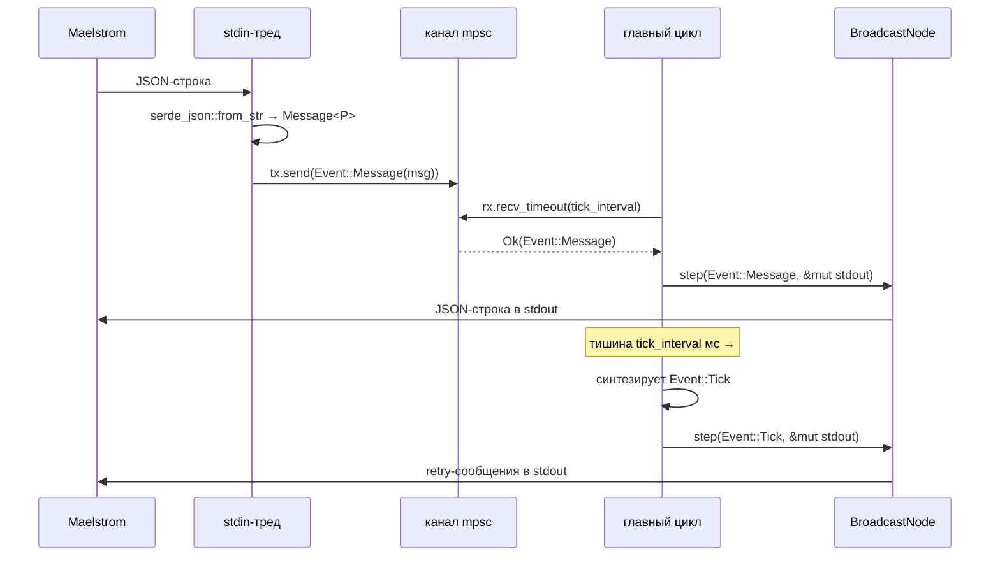
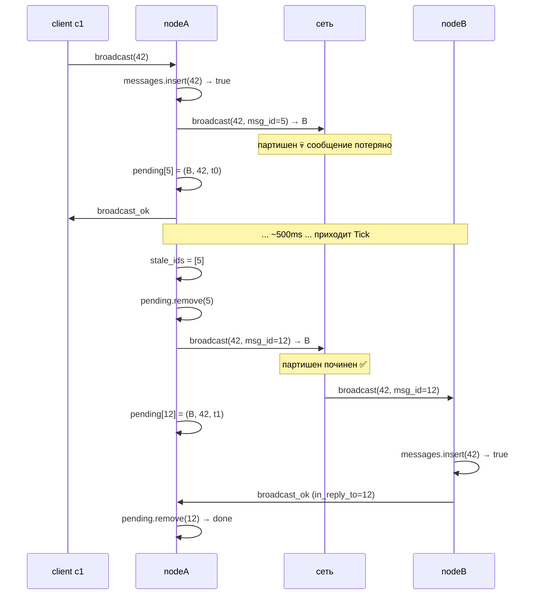

# Broadcast — flow

Сквозная схема всего пути сообщения от Maelstrom до состояния ноды и обратно. Покрывает рантайм `common` и broadcast-логику включая 3c retry.

## Уровни абстракции

```
┌─────────────────────────────────────────────────────────┐
│  Maelstrom (внешний харнесс на JVM)                     │
│    ├─ имитирует клиентов c1, c2, ...                    │
│    ├─ имитирует партишены через --nemesis               │
│    └─ запускает наш бинарь как отдельный процесс        │
└─────────────────────────────────────────────────────────┘
                    │  stdin/stdout (JSON по строке)
                    ▼
┌─────────────────────────────────────────────────────────┐
│  Процесс ноды (target/release/broadcast)                │
│                                                         │
│    ┌─────────────────── common::main_loop ──────────┐   │
│    │  ┌──────────────┐         ┌──────────────────┐ │   │
│    │  │ stdin-тред   │──tx────▶│  mpsc::channel   │ │   │
│    │  │ read+parse   │         │  Event<Payload>  │ │   │
│    │  └──────────────┘         └─────────┬────────┘ │   │
│    │                                     │rx        │   │
│    │                            ┌────────▼────────┐ │   │
│    │                            │ главный цикл:   │ │   │
│    │                            │ recv_timeout    │ │   │
│    │                            │  ├ Ok(event)    │ │   │
│    │                            │  └ Timeout→Tick │ │   │
│    │                            └────────┬────────┘ │   │
│    └─────────────────────────────────────┼──────────┘   │
│                                          │              │
│                                  step(event, out)       │
│                                          ▼              │
│    ┌──────────────── BroadcastNode ──────────────────┐  │
│    │  Event::Message                                 │  │
│    │     ├─ Broadcast      → insert + forward + ack  │  │
│    │     ├─ BroadcastOk    → pending.remove          │  │
│    │     ├─ Read           → read_ok                 │  │
│    │     └─ Topology       → save + topology_ok      │  │
│    │  Event::Tick                                    │  │
│    │     └─ retry устаревших в pending               │  │
│    │                                                 │  │
│    │  State:                                         │  │
│    │   ├ messages: HashSet<u64>                      │  │
│    │   ├ topology: HashMap<String, Vec<String>>      │  │
│    │   └ pending:  HashMap<usize, PendingGossip>     │  │
│    └─────────────────────────────────────────────────┘  │
└─────────────────────────────────────────────────────────┘
```

## Init handshake (один раз на старте)

```
Maelstrom ──{init, node_id, node_ids}──▶ нода (stdin)
нода      ──{init_ok}──────────────────▶ Maelstrom (stdout)
```

После handshake `BroadcastNode::from_init` создаёт состояние:
- `node_id`, `next_msg_id = 1`
- `messages = ∅`, `pending = ∅`
- `topology` инициализируется дефолтом «все ноды кроме себя» из `node_ids` (на случай если broadcast придёт раньше topology-сообщения)

## Event loop (common runtime)



Особенности:
- **stdin** читает только spawn-нутый тред. Главный тред с ним вообще не работает.
- **stdout** пишет только главный тред (через `step`). Лок не нужен.
- **Tick** — не настоящее «событие», а **отсутствие** сообщения в течение `tick_interval`. Канал сам это синтезирует через `RecvTimeoutError::Timeout`.

## Сообщения broadcast-протокола

| Запрос      | Поля                                        | Ответ           | Поля                 |
|-------------|---------------------------------------------|------------------|----------------------|
| `broadcast` | `message: u64`                              | `broadcast_ok`  | —                    |
| `read`      | —                                           | `read_ok`       | `messages: [u64]`    |
| `topology`  | `topology: {node_id: [neighbor_id, ...]}`   | `topology_ok`   | —                    |

Префиксы `src`: клиент = `c1`, `c2`, ...; нода = `n0`, `n1`, ...

## Обработка `Broadcast` (стержень логики)

```
on Broadcast { message } from <src>:

  is_new = messages.insert(message)

  if is_new:
    neighbors = topology[node_id]
    for neighbor in neighbors:
      if neighbor != src:                       ← пропускаем отправителя
        msg_id = send(neighbor, Broadcast)      ← gossip соседу
        pending[msg_id] = (neighbor, message, now)

  reply broadcast_ok ──▶ src                    ← ВСЕГДА, и клиенту, и ноде
```

Дедупликация и анти-зацикливание:
- `HashSet::insert` возвращает `false` если значение уже было → форварды пропускаются → циклы гасятся за O(1).
- `neighbor != src` — не шлём обратно тому, от кого пришло (оптимизация).

## Обработка `Read` и `Topology`

```
on Read:
  reply read_ok { messages: messages.iter().copied().collect() }

on Topology { topology }:
  self.topology = topology.clone()    ← перетирает дефолт из from_init
  reply topology_ok
```

## 3c — retry / ack

### Получение ack от соседа

```
on BroadcastOk from <src> with in_reply_to = X:
  pending.remove(X)   ← запись закрыта, ретраить больше нечего
```

`in_reply_to` — это msg_id **нашего** исходящего gossip-сообщения. По нему находим в pending запись и удаляем.

### Tick (раз в tick_interval мс)

```
on Tick:
  now = Instant::now()
  stale_ids = [ id  for (id, p) in pending  if now - p.last_attempt > RETRY_TIMEOUT ]

  for old_id in stale_ids:
    p = pending.remove(old_id)
    new_msg_id = send(p.dst, Broadcast { p.message })
    pending[new_msg_id] = (p.dst, p.message, now)
```

Каждый retry получает **новый** msg_id — потому что ack соседа будет ссылаться на тот msg_id, который сосед увидел в текущей попытке.

### Жизненный цикл записи в `pending`

```
                  send в соседа           tick + retry
                  ─────────────▶          ─────────────▶
   [не существует]                [запись id=X]                [запись id=Y]
                                       │
                                       │ broadcast_ok in_reply_to=X
                                       ▼
                                [удалена из pending]
```

## Сквозной сценарий: доставка под партишеном



## Тайминги

| Константа           | Значение         | Зачем                                |
|---------------------|------------------|--------------------------------------|
| `tick_interval`     | 100–200 ms       | как часто проверяем pending          |
| `RETRY_TIMEOUT`     | 500 ms – 1 s     | через сколько считаем ack просроченным |

`RETRY_TIMEOUT > tick_interval`, иначе на каждом тике все pending ретраятся → шторм сообщений.

## Что меняется по стадиям

| Стадия | node-count | nemesis    | Что добавляется в коде                                |
|--------|-----------|-------------|--------------------------------------------------------|
| 3a     | 1         | —           | базовый in-memory store                               |
| 3b     | 5         | —           | gossip fire-and-forget (соседи из topology)            |
| 3c     | 5         | partition   | `pending`, `Event::Tick`, ack по `BroadcastOk`         |
| 3d     | 25        | partition   | бюджет сообщений → smarter fanout / spanning tree      |
| 3e     | 25        | partition   | ещё строже latency → batching, реже ретраи             |
